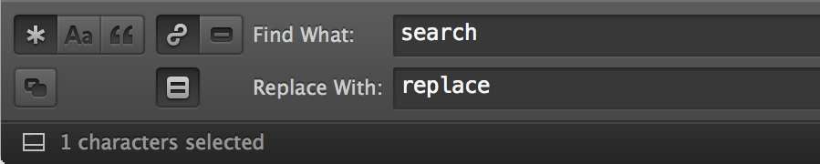

```{r setup, include=FALSE}
knitr::opts_chunk$set(echo = TRUE)
```

## Content

- Legal disclaimer
- Introduction
- Getting data
- Cleaning data
- Pre-pocessing
- Setup and load data
- Basic time analysis
- Exploratory Analysis 1 - Top 30
- Exploratory Analysis 2 - Word Cloud
- Sentiment Analysis
- Resources Used
- Contacts

## Legal Disclaimer

Я ни за что не отвечаю!

## Introduction

On April 22, 2016 one of the notable (36,530 followers) Kazakhstani bloggers - [Asel Bayandarova](https://www.facebook.com/profile.php?id=100004350093268&fref=nf)
has published facebook post titled ["Что можно делать казашкам"](https://www.facebook.com/permalink.php?story_fbid=621724294649235&id=100004350093268)
("What kazakh women are allowed to do"). The post was accompanied by a photo of Asel in green swimming trunks alone, (almost) without demonstrating intimate body parts.

The post has sparked a fierce discussion between facebook users of Kazkhstan (and abroad), who divided into two groups with one being supportive to the Original Poster, while the other blaming OP up to the use of obscene vocabulary.

Overall this post got more than 20,000 likes, 990 shares and about 11,000 comments + replies, so the purpose of this project is to make exploratory and sentiment analysis of those comments.

## Getting data

The entire process of getting and cleaning data is neither optimal (even close) nor easily reproducible in its current state. The development of a method to obtain / clean such data in optimal way has become a separate project. If you are interested in this topic, please add / follow me using any of social contacts provided at the end of the report.

All the comments and replies were manually opened, copied and pasted to [Sublime Text 3](https://www.sublimetext.com/3) for further processing.

There is [special bookmarklet](http://com.hemiola.com/2015/08/29/expand-all/), which allowes to open all Comments, See More, Replies, View more etc. links automatically, but you need to know that Facebook stops delivering comments hidden behind *View more comments* link after a certain point; you click it and nothing happens. This bookmarklet bumps into the same limitation.

One year later, in 2017, I have added several fresh comments that people were still making. File with raw text contains 34,890 lines and occupies 2,3 MB of disk space.

Here is the sample of the unprocessed text file containg all the information. 

```
Erzhan Malkovich
Erzhan Malkovich мя саган...
· 5 · April 22 at 1:32am
Alexander Gutin
Alexander Gutin Вы, дураки, гордиться должны, что казашки красавицы, а не глаза выпучивать и ножками топать.
· 58 · April 22 at 1:34am
Ayan Kaliahmet
Ayan Kaliahmet мы и гордимся красавицами но не шлюхами...
· 1 · April 22 at 5:21am

...

Константин Шакиров
Константин Шакиров Смысл обсуждать то,о чём уже отшумели летние дожди??)))))
Like · Reply · April 23 at 09:00am
Berlin Irisheff
Berlin Irisheff С такой чудесной фигурой позволительно рассуждать о чем угодно.
Like · Reply · 1 · April 23 at 12:00am
Omir Shynybekuly
Omir Shynybekuly 20 148 лайков...
Наверное это рекорд для казахского сегмента Фб?
Like · Reply · April 23 at 12:00am
```

## Cleaning data

As we can see from the sample above, general structure of the text is as follows:

1. FirstName LastName + '\\n'
2. Body of a comment, always starts with FirstName LastName + text + '\\n'
     - may be empty or contain word 'photo' if only a picture was used as a comment
3. Special bod (Unicode '\U00B7') followed by either of two:
     - Number of likes + bod + Month Date with one or two digits + 'at' + time + '\\n'
     - Month Date with one or two digits + 'at' + time + '\\n'

Sublime Text 3 has very convenient search/replace tool which supports regular expressions:


Below you will find all the commands and regex search strings that were used step by step to find and replace / delete certain text constructions.

```
16 lines with unopened reply comment
^\d reply
delete them

dates without year, these are only present in fresh comments made in 2017
^(·\s\w+\s\d{1,2}) at
replcae with (adds year)
\1, 2017 at

lines without any likes, they start with bod + space + capital letter (month name)
^·\s([A-Z]{1}) 
replace with
· 0 · \1
so that all similar constructions now look alike:
· 5 · April 22 at 5:24am

simplify previous string to ease further processing:
search for
^·\s(\d+)\s·\s(\w+)
replace with
· \1\n· \2
to split it into two strings and get
· 5
· April 22 at 5:24am

empty lines between first and last names
^(\w+)\s(\w+)\n\s
\1\s\2\n
delete them

stuck lines, about 150 entries, need to delete manually :)
[ap]m\n\w+\s\w+

smiles and other emoticons excluding letters, numbers, punctuation etc
[^a-zA-Z0-9а-яА-Яё:.,\-='"()·!?Ұүқôәіңғ\s]
copy them all and save to a different file for further counting / processing
```

Some other regex search strings that were used and may prove useful while processing this file:

```
lines containing "· 2 · April 22"
^(\s*.\s*[a-zA-Z0-9]*\s.*\s[a-zA-Z0-9]*\s*\d*\sat\s\d*:\d*(am|pm))

lines containing "· 2 ·"
^(\·\s*\d*\s.*)

lines containing "· Edited"
^(\s*\·\s*Edited)

lines with first last names only
^\w+\s+\w+\n

first and double last name, which is connected by "-"
^\w+\s+\w+-\w+\n

double, triple etc newlines
^\n{2,}

somebody's photo.
^[A-ZА-Я]\w{2,}\s*[A-ZА-Я]\w*'s photo.

first and last names in the beginning, including russian and kazakh (diacritic) letters
^[A-ZА-ЯҚƏ]\w{2,}(\s+|\.?)[A-ZА-ЯҚƏ]\w*\s+
```
Overall this part took most of the time and involved lots of manual work. File with processed text contains 55,145 lines and occupies 2,3 MB of disk space. Here is the sample of the file after all the cleaning was done:

```
Erzhan Malkovich
Erzhan Malkovich мя саган...
· 5
· April 22, 2016 at 1:32am

Alexander Gutin
Alexander Gutin Вы, дураки, гордиться должны, что казашки красавицы, а не глаза выпучивать и ножками топать.
· 58
· April 22, 2016 at 1:34am

Ayan Kaliahmet
Ayan Kaliahmet мы и гордимся красавицами но не шлюхами...
· 1
· April 22, 2016 at 5:21am

...

Константин Шакиров
Константин Шакиров Смысл обсуждать то,о чём уже отшумели летние дожди??)))))
· 0
· April 23, 2017 at 09:00am

Berlin Irisheff
Berlin Irisheff С такой чудесной фигурой позволительно рассуждать о чем угодно.
· 1
· April 23, 2017 at 12:00am

Omir Shynybekuly
Omir Shynybekuly 20 148 лайков...
Наверное это рекорд для казахского сегмента Фб?
· 0
· April 23, 2017 at 12:00am
```

## Pre-processing

For pre-processing of the cleaned file I wrote special parser function. Knowing the structure of the prepared file, we can go through it line by line saving required pieces of information to a data frame.

```{r parser}
# Information parser for pre-processed file
# (c) 2017 Denis Rasulev
# All Rights Reserved

parse_comments <- function(comments) {
     # this function goes through pre-processed comments file row by row,
     # finds information by certain markers and saves it to data frame as
     # name, text of comment, number of likes and date posted
     # returns data.frame['name','cmnt','like','year',''month','day','hour']

     # load required libraries
     library(lubridate)  # Make Dealing with Dates a Little Easier

     # save length of file with comments
     number_of_rows <- length(comments)

     # prepare empty data frame to store name, comment, likes and dates
     df <- data.frame(matrix(ncol = 4, nrow = number_of_rows))
     colnames(df) <- c('name','cmnt','like','date')

     for (i in 1:number_of_rows ) {

          # if row is empty...
          if ( comments[i] == "" ) {

               # then next row contains commenter's name
               df[i, 'name'] <- comments[i + 1]

               # third row after empty one contains text of a comment and
               # it always starts with the name of a commenter so we remove it
               comment_text <- sub(paste0(comments[i + 1],' '), '', comments[i + 2])

               # text of a comment may be on several lines so we need index
               # to read them all
               j <- 3

               # while next line doesn't start with middle dot '·' (unicode 00B7)
               while (substring(comments[i + j], 1, 1) != '\U00B7') {

                    # check if we have reached end of the file where we need to
                    # break the loop
                    if ( i + j > number_of_rows ) {
                         break
                    }

                    # if not end then add every line to comment
                    comment_text <- paste(comment_text, comments[i + j])
                    j <- j + 1
               }

               # save complete text of a comment
               df[i, 'cmnt'] <- comment_text

               # save number of likes for a comment, removing midle dot
               df[i, 'like'] <- sub('\U00B7 ', '', comments[i + j])

               # save date when a comment was posted, removing midle dot
               df[i, 'date'] <- sub('\U00B7 ', '', comments[i + j + 1])
          }
     }

     # remove empty rows, consisting only of NAs
     df <- na.omit(df)

     # convert number of likes from character to number
     df[,'like'] <- as.numeric(df[,'like'])

     # split date column for convenience of further analysis
     df[,'dt']    <- parse_date_time(df[,'date'], orders = "mdy IMp")
     df[,'year']  <- year(df[,'dt'])
     df[,'month'] <- month(df[,'dt'])
     df[,'day']   <- day(df[,'dt'])
     df[,'hour']  <- hour(df[,'dt'])

     # remove unused columns
     df[,c('date','dt')] <- NULL

     # return clean data frame
     return(df)
}

```

Parsing takes some time and returns clean and tidy data frame.

## Setup and load data

```{r load_data, message=FALSE, warning=FALSE}
# Facebook Comments Exploration and Analysis
# (c) 2017 Denis Rasulev
# All Rights Reserved

# set working directory
setwd('/Volumes/data/projects/fb_sentiment/')

# load required libraries and functions
library(tm)         # Framework for text mining applications within R
library(NLP)        # Basic classes and methods for Natural Language Processing
library(ggplot2)    # Implementation of the grammar of graphics in R
library(wordcloud2) # Fast visualization tool for creating wordcloud
source("parser.r")
source("helper.r")

# if parsed file does not exist
if (!file.exists("data/comments.rds")) {

     # then load pre-processed comments file
     comments_file  <- readLines("data/comments_processed.txt",
                                 encoding = "UTF-8", skipNul = FALSE, warn = FALSE)

     # parse everything from it
     parsed <- parse_comments(comments_file)

     # and save it to disk
     saveRDS(parsed, file = "data/comments.rds")

     # clear memory
     rm(comments_file, parse_comments, parsed)
}

# if parsed file already exists, read it in
df_comments <- readRDS("data/comments.rds")
```

## Basic time analysis

```{r year, fig.align='center'}
# aggregate data by time frame
t1 <- table(df_comments$year)   # year
t2 <- table(df_comments$month)  # month
t3 <- table(df_comments$day)    # day
t4 <- table(df_comments$hour)   # hour

# distribution of comments by year
par(mar = c(2,4,4,1) + 0.1)
barplot(t1,
        col = "lightgreen",
        ylim = c(0,12000),
        las = 1)
title("Number of Comments by Year", adj = 0.5, line = 2)
```

As we can see, vast majority of the comments were made in 2016, but some insignificant interest still took place in 2017. Let see how it spreaded amongst months.

```{r month, fig.align='center'}
# distribution of comments by month
par(mar = c(2,4,4,1) + 0.1)
barplot(t2,
        col = "lightgreen",
        ylim = c(0,12000),
        las = 1)
title("Number of Comments by Month", adj = 0.5, line = 2)
```

Here we can see that almost all comments were made in April alone with very insignificant and reducing number in the following months. That means that popularity of the post didn't went beyond one month. Let's see how the number of comments is spreaded beween days.

```{r days, fig.align='center'}
# distribution of comments by day
par(mar = c(2,4,4,1) + 0.1)
barplot(t3,
        col = "lightgreen",
        ylim = c(0,5000),
        las = 1)
title("Number of Comments by Day", adj = 0.5, line = 2)
```

Here we can clearly see that peak of commenting was in a first few days, mainly, from 22 (max) to 26, i.e. almost 4 days people were actively expressing their ideas and emotions related to the post. This is quite notable activity in kazakhstani segment of facebook.

```{r hours, fig.align='center', fig.width=10}
# distribution of comments by hour
par(mar = c(2,4,4,1) + 0.1)
barplot(t4,
        col = "lightgreen",
        ylim = c(0,800),
        las = 1)
title("Number of Comments by Hour", adj = 0.5, line = 2)
```

Activity by hour shows few interesting findings. First, we can see that people were commenting most actively in the first half of a day, mainly from 8am till 12 noon, then activity strongly goes down (lunch time?) and after that we can see another, lower peak, which starts from 7pm till 12 midnight. Large number of comments made from midnight till 8am (left part of the graph) is mostly related to twenty-four hours time period following immediately after the post was made.

## Exploratory Analysis 1 - Emoticons & Words

There were numerous emoticons used alongside the comments. Here is some statistics on their usage frequencу.

### Emoticons

| Positive | Frequency | Negative | Frequency |
|:--------:|:---------:|:--------:|:---------:|
|    :)    |    914    |    👎    |    133    |
|    👍    |    621    |    :(    |     91    |
|    😂    |    578    |    😡    |     63    |
|    👏    |    189    |    🙈    |     52    |
|    😍    |     54    |    😱    |     51    |
|    😊    |     44    |    😈    |     16    |
|    👌    |     42    |    👊    |     15    |
|    😁    |     40    |    😠    |     14    |
|    😀    |     35    |    😕    |     13    |
|    😘    |     18    |          |           |
|          |  **2535** |          |  **448**  |

We can clearly see that number of positive emoticons is significantly larger than negative ones.

Let's see some statistics on words used to express attitude to the post. These words were searched for manually, through regular expressions, since there are no (known to me) positive/negative words dictionaries for russian/kazakh languages.

### Words

| Positive                     | Frequency | Negative                     | Frequency |
|:----------------------------:|:---------:|:----------------------------:|:---------:|
|красавица/отка/ивая/ота/ивое  |    454    |Ұят/уят/сыз                   |    415    |
|молодец/чина/чинка            |    357    |намыс/сыз                     |    171    |
|смело/ая                      |    272    |позор                         |    143    |
|супер                         |    114    |стыд/но                       |    141    |
|браво                         |     84    |дура                          |    140    |
|поддерживаю                   |     69    |ужас/но                       |     71    |
|умная                         |     64    |шлюха (+варианты)             |     48    |
|респект                       |     43    |фу                            |     42    |
|круто/ая                      |     35    |проститутка                   |     23    |
|секси                         |     32    |глупая                        |     15    |
|отличная                      |     24    |тупая                         |     15    |
|шикарная                      |     22    |сука                          |     15    |
|симпатичная                   |     14    |блядь (+варианты)             |     11    |
|прелесть                      |     10    |дешевка/ая                    |     10    |
|богиня                        |      5    |тьфу                          |     10    |
|                              |           |курица                        |      8    |
|                              |           |девка                         |      6    |
|                              |           |уродка                        |      2    |
|                              |  **1599** |                              |  **1286** |

As we can see, there is almost a parity, with some minor advantage (55% vs 45%) towards positive, supportive words.

Due to the nature of the photo, there were some special words used to describe intimate parts of a body. However, as statistics shows, there were not very significant amount of them in the text.

### Special words

| Positive      | Frequency     |
|:-------------:|:-------------:|
|попа/жопа      | 47            |
|сиськи         | 31            |
|тема сисек     | 25            |

This concludes first part of exploratory analysis.

## Exploratory Analysis 2 - Top 30 Info

In this part we'll make some quantitative analysis of the text.

```{r top_30, fig.align='center', fig.height=8, fig.width=8}
# top commenters by number of comments
t <- as.data.frame(table(df_comments$name))
t <- t[order(t$Freq, decreasing = TRUE),]
names(t)[1] = 'name'
names(t)[2] = 'comments'

# show top commenters as bar plot
par(mar = c(2,12,3,1) + 0.1)
barplot(t$comments[1:30],
        names.arg = t$name[1:30],
        col = rainbow(45),
        xlim = c(0,300),
        ylim = c(35,0),
        horiz = TRUE,
        las = 1)
grid(NULL, NA, lwd = 1, col = "lightgray", lty = "dotted")
title("Top 30 people by the number of posted comments", adj = 0, line = 0.5)
```

Absolute leader is **`r t$name[1]`** with `r t$comments[1]` comments. Second place is **`r t$name[2]`** with `r t$comments[2]` comments and number three is **`r t$name[3]`** with `r t$comments[3]` comments.

Now let's see whose comments got most likes.

```{r most_liked, fig.align='center', fig.height=8, fig.width=8}
# most liked commenters
v <- df_comments[order(df_comments$like, decreasing = TRUE),]

# show top most liked as bar plot
par(mar = c(3,12,3,1) + 0.1)
barplot(v$like[1:30],
        names.arg = v$name[1:30],
        col = "lightgreen",
        xlim = c(0,100),
        ylim = c(35,0),
        horiz = TRUE,
        las = 1)
grid(NULL, NA, lwd = 1, col = "lightgray", lty = "dotted")
title("Top 30 people whose comments got most likes", adj = 0, line = 0.5)
```

Absolute leader is **`r v$name[1]`** with `r v$like[1]` likes. Second place is **`r v$name[2]`** with `r v$like[2]` likes and number three is **`r v$name[3]`** with `r v$like[3]` likes.

For the leading comment from Seke Kozgan: "и тут появляется он..." with photo of "Uyatman", please, see explanation below.

Short time before this post there was another notable activity in kazakhstani facebook, related to a person who has covered with some cloth a statue of the girl with visible nipples because, according to him, this was "uyat" (shame). After that he has got some fame and nickname "Uyatman". Two activities somewhat interefered with each other and that explaines why this particular comment got most likes.

Now let's see most lengthy comment and its' characteristics.

```{r most_lengthy, results='hide', fig.align='center', fig.height=8, fig.width=8}
# most lengthy comment
comment_length = 0
for (i in 1:nrow(df_comments)) {
     if (nchar(df_comments$cmnt[i]) > comment_length) {
          comment_length <- nchar(df_comments$cmnt[i])
          index <- i
     }
}

# print out findings
sprintf("Author of the most lengthy comment is %s", df_comments$name[index])
number_of_words <- sapply(gregexpr("\\W+", df_comments$cmnt[index]), length) + 1
sprintf("The comment contains %d characters and %d words",
        nchar(df_comments$cmnt[index]), number_of_words)

# clean memory
rm(v)
```

Author of the most lengthy comment is **`r df_comments$name[index]`**. The comment contains **`r nchar(df_comments$cmnt[index])`** characters and **`r number_of_words`** words.

This concludes part two of exploratory analysis.

## Exploratory Analysis 3 - Word Cloud

```{r corpus, fig.align='center', fig.height=8, fig.width=8}
# because we have relatively small number of documents we will use simple corpus
df_corpus = Corpus(VectorSource(df_comments$cmnt), readerControl = list(language = "rus"))

# load list of russian stop words
ru_stopwords <- readLines("ru_stop_words.txt", encoding = "UTF-8", skipNul = TRUE, warn = FALSE)
kz_stopwords <- readLines("kz_stop_words.txt", encoding = "UTF-8", skipNul = TRUE, warn = FALSE)

# remove contact information in the beginning of the file
ru_stopwords <- ru_stopwords[5:length(ru_stopwords)]
kz_stopwords <- kz_stopwords[5:length(kz_stopwords)]

# combine extended and standard stopwords lists
extended_stopwords <- c(stopwords('russian'), ru_stopwords, kz_stopwords)

# pre-process corpus
df_corpus <- tm_map(df_corpus, removeNumbers)
df_corpus <- tm_map(df_corpus, removePunctuation)
df_corpus <- tm_map(df_corpus, content_transformer(tolower))

# replace often misspelled significant word for correct spelling with diacritics
df_corpus <- tm_map(df_corpus, content_transformer(gsub),
                    pattern = "уят", replacement = "ұят")

# remove insignificant words
words_to_remove <- c("like","wink","smile","photo","emoticon")
df_corpus <- tm_map(df_corpus, removeWords, words_to_remove)

# remove stop words and extra spaces
df_corpus <- tm_map(df_corpus, removeWords, extended_stopwords)
df_corpus <- tm_map(df_corpus, stripWhitespace)

# create term-document matrix
tdm <- TermDocumentMatrix(df_corpus)

# remove sparse words:
# 0.99999 - remain all words, nothing is deleted
# 0.9999  - remain words encountered more than 2 times
# 0.999   - remain words encountered more than 10 times
tdm <- removeSparseTerms(tdm, 0.999)

# create data frame with words sorted by frequency
d <- sort_freq(tdm)

# show top words as bar plot
par(mar = c(3,6,3,1) + 0.1)
barplot(d[1:30,]$freq,
        names.arg = d$word[1:30],
        col = "lightgreen",
        xlim = c(0,600),
        ylim = c(35,0),
        horiz = TRUE,
        las = 1)
grid(NULL, NA, lwd = 1, col = "lightgray", lty = "dotted")
title("Top 30 most frequently used words", adj = 0, line = 0.5)
```

```{r word_cloud, fig.height=8, fig.width=10}
# build word cloud
set.seed(2017)
wordcloud2(data = d)
```

## Sentiment Analysis

Due to lack of resources - later.

## Resources used

- Facebook
- Safari, Chrome
- Sublime Text 3
- Bookmarklet
- R Studio
- Dash
- MacBook Pro 15
- Cofee

## Contacts

- [LinkedIn](https://www.linkedin.com/in/denisrasulev)
- [Pinterest](https://pinterest.com/denisrasulev)
- [Twitter](https://twitter.com/denisrasulev)
